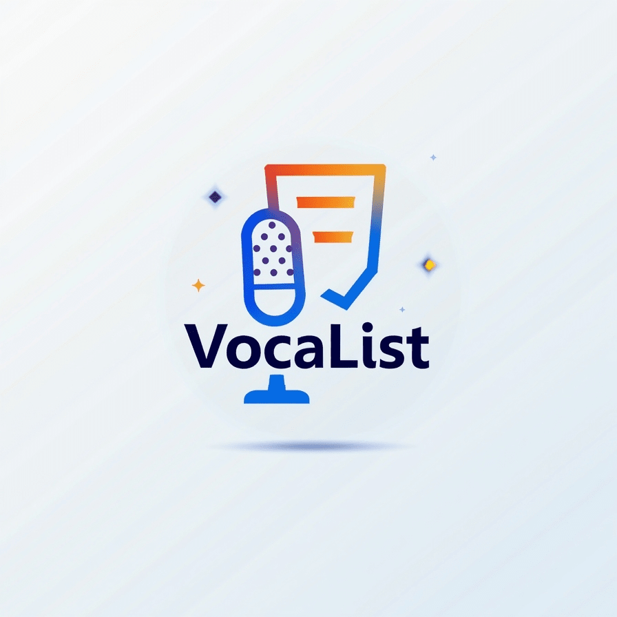

<!-- PROJECT LOGO -->

  

<h1 align="center">🎙️ VocaList – Voice to Todoist AI Assistant</h1>

  <em>Turn your voice notes into productive, motivational to-do tasks – fully automated, powered by free APIs!</em>

---

## 📽 Demo

  

---

## 🚀 Features
- 🎤 **Voice Input via Telegram**
- 📝 **Accurate Transcription** using Hugging Face Whisper
- 🤖 **Task Extraction** + automatic motivational message
- ✅ **Automatic Todoist Creation**
- 💸 **100% Free APIs** (no paid tools)
- ⚡ Built on **n8n** for seamless automation

---

## 🛠 Tech Stack

  
  
  
  

---

## 📂 Project Structure
